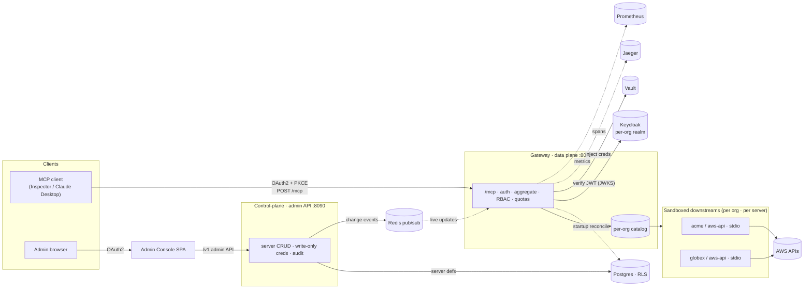
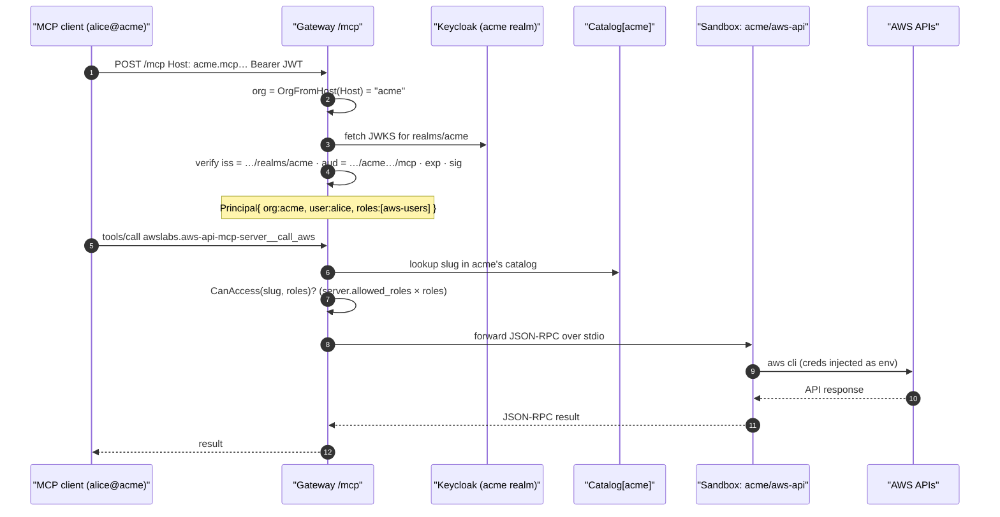
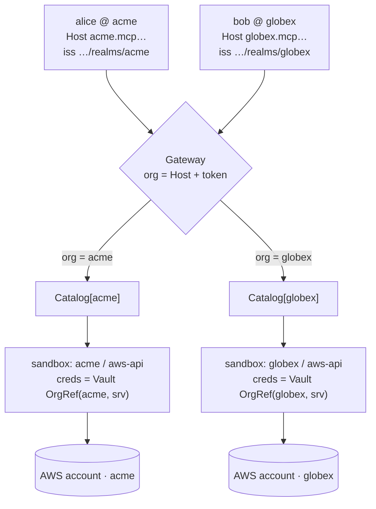
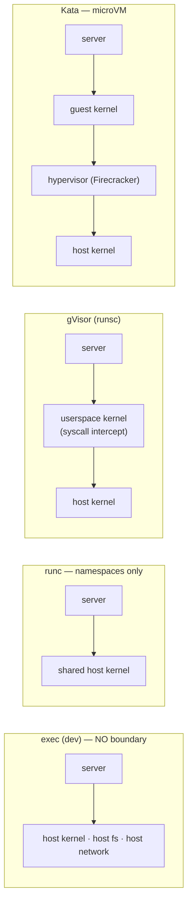
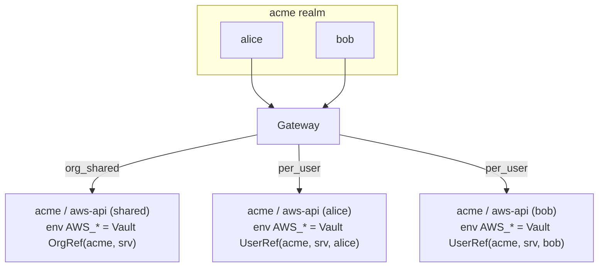

# Implementation & Isolation — current build vs. the alternatives

How the gateway runs **locally today**, how an MCP call is authenticated and
routed to the *right* downstream server (even when two companies register the
**same** MCP), and how downstream servers — focusing on the **AWS API MCP**
(stdio, AWS CLI creds) — are isolated under the current runtime versus the
alternatives we evaluated.

> Companion docs: [Solution Comparison](solution-comparison.md) (architectures &
> runtimes vs. the 7 criteria), [Multi-tenant (Keycloak)](multi-tenant-keycloak.md),
> [Local gVisor Sandbox](local-sandbox.md).

## 1 · What runs locally



- **Control plane** owns server definitions (Postgres, row-level-security per org)
  and publishes changes on **Redis pub/sub**; the **gateway reconciles from
  Postgres on startup** as the durability backstop.
- **Data plane** (gateway) authenticates every `/mcp` call against the org's
  **Keycloak realm**, enforces **RBAC + quotas**, injects **credentials** from
  Vault, and routes to a **remote HTTP** server or a **sandboxed stdio** server.
- Locally the gateway/control-plane run on the host (`make run-gateway` /
  `run-control-plane`); everything else is the `deploy/dev` docker stack.

## 2 · The MCP call — auth + routing

A single request carries everything needed to resolve **which org** and **which
server**, with no shared mutable routing state.



The three bindings that make this safe (all enforced in `pkg/authz`):

| Binding | Source | Checked against |
|---|---|---|
| **Org** | `Host` subdomain (`{org}.{base}`) | the token's **issuer** must be `…/realms/{org}` |
| **Audience** | token `aud` | the org's **MCP resource** (`https://{org}.{base}/mcp`, or the dev override) |
| **Authorization** | token `realm_access.roles` | each server's **`allowed_roles`** — on *both* `tools/list` and `tools/call` |

## 3 · Same MCP, different companies — how they don't collide

`acme` and `globex` can both register a server slugged `awslabs.aws-api-mcp-server`.
They never share an instance, a catalog entry, or credentials: the **catalog is
keyed by org**, and the org is derived from the request (Host + token issuer), not
from the slug.



- **Same slug → two distinct catalog entries** (`AddScoped(orgID, slug, …)`), each
  built into its **own sandbox instance**.
- A `globex` token can never address `acme` data: the issuer wouldn't match
  `…/realms/acme`, and the catalog lookup is org-scoped (HC-1, tenant isolation).
- Credentials are fetched per org (`secrets.OrgRef(org, server)`) — `acme`'s AWS
  keys are only ever injected into `acme`'s instance.

## 4 · Isolation levels (the sandbox boundary)

`MCP_SANDBOX_RUNTIME` selects the boundary untrusted stdio code runs behind. The
hardening (default-deny egress `--network none`, **read-only** rootfs, `--cap-drop
ALL`, `no-new-privileges`, CPU/mem/pid limits) is applied by the container
runtimes; `exec` applies none of it.



| Runtime (`MCP_SANDBOX_RUNTIME`) | Boundary | Shared kernel? | Default egress | Cold start | Density | Untrusted-safe? |
|---|---|---|---|---|---|---|
| `exec` | OS process only | yes (host) | host network | none | highest | **No** — dev only |
| `runc` / `container` | namespaces + cgroups | yes (host) | `none` (+ allowlist) | low | high | **No** (shared kernel; warned) |
| `gvisor` (`runsc`) | userspace kernel intercepts syscalls | no (gVisor kernel) | `none` (+ allowlist) | low–med | med–high | **Yes** |
| `kata` | hardware-virtualized guest kernel | no (own kernel) | `none` (+ allowlist) | med | med | **Yes (strongest)** |

The sandbox warm pool (`sandbox-supervisor`) keeps instances hot for latency and
**scales to zero** when idle, so isolation doesn't cost a cold start per call.

## 5 · Focus: the AWS API MCP (stdio + CLI creds / env)

The AWS server is the interesting case because it is **stdio** *and* **needs
network egress** (to reach AWS APIs) — unlike a pure compute MCP that can run with
no network at all.

How it's wired (from the `mcpServers` import):

```json
{ "command": "uvx", "args": ["awslabs.aws-api-mcp-server@latest"],
  "env": { "AWS_REGION": "us-east-1" } }
```

- **Config env** (`AWS_REGION`, …) is passed straight into the instance.
- **Credentials** are injected as additional env (`AWS_ACCESS_KEY_ID`, …) by the
  gateway at launch — `org_shared` (one set for the org) or `per_user` (a distinct
  instance per caller, each carrying *that* user's keys). Secrets come from Vault;
  the console only ever **writes** them (write-only, never displayed).



**Isolation of the AWS server, by runtime:**

| | `exec` (current dev default) | `gvisor` (prod) | `kata` (prod, strongest) |
|---|---|---|---|
| Process | host process | gVisor sandbox | microVM |
| Filesystem | **host fs** (workdir in `/tmp`) | read-only rootfs + tmpfs | read-only rootfs in guest |
| Network | **full host network** | `none` → **egress allowlist** to AWS endpoints | per-VM egress policy |
| AWS creds (env) | per-process only | confined to the sandbox | confined to the VM |
| Blast radius if the server is compromised | **the whole host** | the gVisor sandbox | one microVM |
| Cross-tenant / cross-user creds | separated by *which instance* | + kernel isolation | + hardware isolation |

So even in dev the **right creds reach the right instance** (per-org / per-user env
injection), but only the **container runtimes** make that a *defended* boundary.
Because the AWS MCP needs egress, its sandbox relaxes the default `--network none`
to a **controlled allowlist** (AWS API endpoints) rather than open host network —
the key difference from an untrusted no-network server.

## 6 · Trade-offs vs. other architectures

| Architecture | Isolation | Latency | Density | Creds isolation | Egress control | Verdict here |
|---|---|---|---|---|---|---|
| **Shared process** (one per MCP type, all tenants) | none | best | best | none (shared env) | none | ✗ breaks tenancy |
| **Process-per-tenant** (`exec`) | OS process | very low | high | per-process env | host network | dev only |
| **Namespaced container** (`runc`) | namespaces, shared kernel | low | high | per-container | per-container | ✗ not a boundary for untrusted code |
| **gVisor** (`runsc`) | userspace kernel | low–med | med–high | per-sandbox | allowlist | ✓ default prod boundary |
| **microVM** (`kata`/Firecracker) | HW-virtualized | med | med | per-VM | per-VM | ✓ strongest; for untrusted/regulated |
| **Per-request cold container** | per call | high (cold per call) | low | per call | per call | ✗ latency too high for tool calls |
| **Remote-only** (no local stdio) | the operator's infra | network RTT | n/a | delegated | delegated | ✓ for `remote_http` servers (SSRF-guarded) |

**Why the current design.** A single OAuth-protected `/mcp` per org aggregates
**both** sandboxed-stdio and remote-HTTP servers. The boundary is **pluggable**
(`exec`→`gvisor`→`kata`) so dev stays fast and prod stays safe without changing the
control/data-plane contract; a **warm pool + scale-to-zero** keeps per-tenant
isolation affordable. The cost: running untrusted stdio safely *requires*
gVisor/Kata (a Linux VM on macOS — see [Local gVisor Sandbox](local-sandbox.md)),
and egress-needing servers like the AWS MCP need an explicit network allowlist
rather than the safe `--network none` default.
