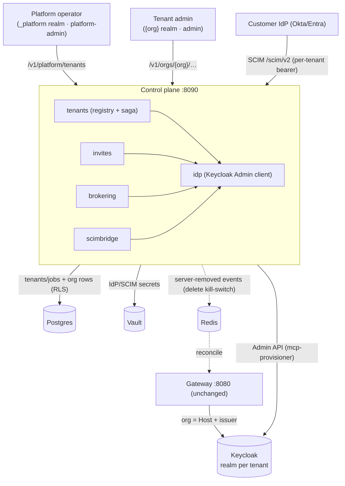
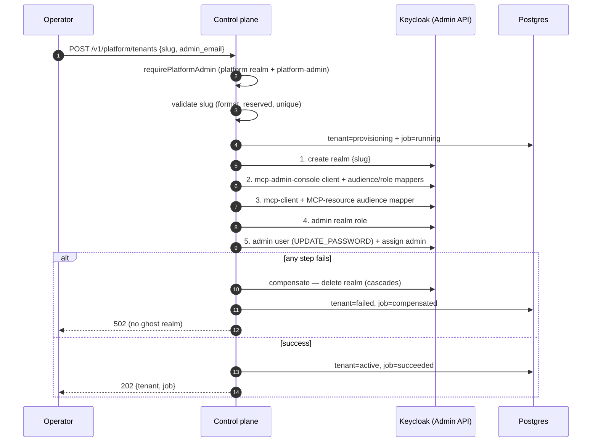
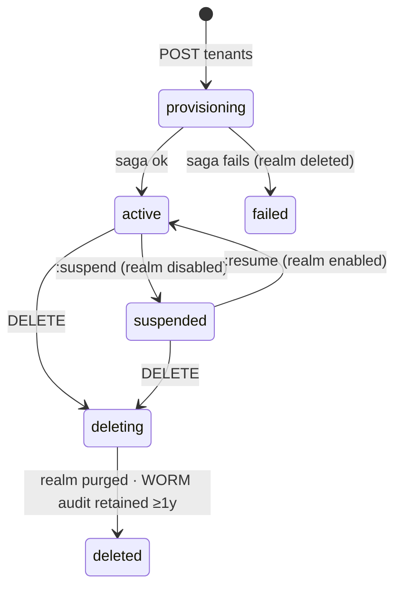
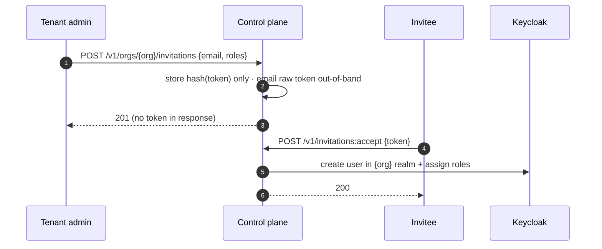
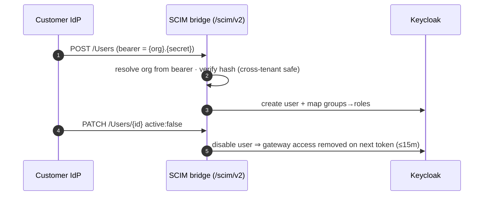

# Tenant Provisioning (control plane)

How the control plane **onboards and offboards a company as a fully isolated
tenant** (`003-tenant-provisioning`). A **tenant is a Keycloak realm**: creating
one is a Keycloak **Admin API** operation; populating it with users is done via
**invitations**, **OIDC/SAML brokering**, and **SCIM** directory sync. The
**gateway is unchanged** — it still derives the org from the request Host + token
issuer.

> SCIM has no "create realm" operation. Realm creation (Half A) is Admin-API
> driven; SCIM is one of the user-provisioning mechanisms (Half B), used *after*
> the realm exists.

## Architecture



## Provision flow (US1)

Operator-initiated, an **idempotent saga with compensation** — any failed step
rolls back (deletes the realm), so there is never a half-provisioned "ghost" realm.



> **403-retry note:** after creating a realm, the provisioner service account's
> (master-admin) composite gains that realm's management roles. A token minted
> *before* the realm existed lacks them, so the Admin client **retries once on 403
> with a fresh token**.

## Lifecycle (US3)



- **Suspend** disables the realm → the gateway rejects new/refreshed tokens
  (existing short-lived tokens expire ≤ 15 min).
- **Delete** fires the **kill-switch** (removes the org's servers → `serverevents`
  removals → gateway terminates instances + revokes injected creds), deletes the
  realm + clients + credentials, and records `audit_retention_until = now + ≥ 1 year`
  (Constitution VI) before the WORM audit is purged.

## Operator (platform) API — `/v1/platform/tenants`

Auth: a bearer from the **platform realm** with the **`platform-admin`** role.

| Method | Path | Action |
|---|---|---|
| `POST` | `/v1/platform/tenants` | provision `{slug, display_name, admin_email}` → `202` |
| `GET` | `/v1/platform/tenants` · `/{slug}` · `/{slug}/jobs/{id}` | list · detail · job status |
| `POST` | `/v1/platform/tenants/{slug}/suspend` · `/resume` | disable / re-enable the realm |
| `DELETE` | `/v1/platform/tenants/{slug}` | purge + retain WORM audit ≥ 1 year |

## User provisioning (Half B) — `/v1/orgs/{org}/…` (org `admin` role)

**Invitations (US2)** — admin invites by email + roles; the invitee accepts and is
created **in that realm only**. The raw token is emailed once and **never** stored
or returned.



**Brokering (US4)** — `PUT /v1/orgs/{org}/identity-providers/{alias}` configures an
OIDC/SAML IdP on the realm with group→role mappings; first-login is JIT. The IdP
client secret goes to **Vault** and is **never echoed**.

**SCIM directory sync (US4)** — `PUT /v1/orgs/{org}/directory-sync` issues a
**per-tenant bearer** (shown once). The customer's IdP drives the SCIM 2.0 endpoint:



## Connecting a client to a new tenant

A provisioned tenant `{slug}` is reached at `{slug}.{base-domain}`. Its **MCP
resource** — the OAuth **audience** the gateway requires and advertises (RFC 9728)
— is the tenant's `/mcp` URL:

| Env | Resource (audience) |
|---|---|
| **dev** | `http://{slug}.mcp.example.com:8080/mcp` |
| **prod** | `https://{slug}.mcp.example.com/mcp` |

- **Provisioning sets this automatically** — the new realm's `mcp-client` gets an
  audience mapper = `MCPResource(slug,…)`. You don't enter it by hand.
- **In the MCP Inspector you normally don't type the resource** — it is
  auto-discovered from `http://{slug}.mcp.example.com:8080/.well-known/oauth-protected-resource`.
  Set **Client ID = `mcp-client`** and **Scope = `openid`**. If a field *does* ask
  for the resource, use the URL above.
- It must match the gateway's `MCP_RESOURCE_TEMPLATE` (dev `http://%s.mcp.example.com:8080/mcp`),
  and you need a hosts entry `127.0.0.1 {slug}.mcp.example.com` so the subdomain resolves.

## Creating a tenant: API or manual realm import

There are two ways to stand up a tenant realm:

**A — Platform API (recommended).** `make provision-tenant` (or `POST /v1/platform/tenants`)
runs the idempotent saga *and* records the control-plane rows — the `tenants`
registry entry plus the org-scoped tables that enable invites / brokering / SCIM.
It is audited, compensating, and keeps Keycloak and the control plane consistent.

```sh
make provision-tenant SLUG=globex NAME='Globex' ADMIN_EMAIL=ops@globex.example
```

**B — Manual Keycloak realm import.** For a hand-built realm, paste a
realm-representation JSON into **Keycloak → Create realm → *Resource file*** (or
`kcadm create realms -f realm.json`). This creates only the realm + clients + role
+ admin user — **not** the control-plane records — so prefer A unless you have a
reason to build the realm by hand. The one per-tenant value that matters is the
`mcp-client` audience mapper: `included.custom.audience` **must** equal the
gateway's MCP resource for the slug — dev `http://{slug}.mcp.example.com:8080/mcp`.

<details>
<summary><strong>Realm JSON for manual import</strong> — replace <code>globex</code> with your slug (click to expand)</summary>

```json
{
  "realm": "globex",
  "enabled": true,
  "sslRequired": "none",
  "accessTokenLifespan": 900,
  "ssoSessionIdleTimeout": 28800,
  "ssoSessionMaxLifespan": 86400,
  "roles": { "realm": [ { "name": "admin" } ] },
  "clients": [
    {
      "clientId": "mcp-admin-console",
      "name": "MCP Admin Console",
      "publicClient": true,
      "standardFlowEnabled": true,
      "directAccessGrantsEnabled": false,
      "redirectUris": ["http://localhost:5173/*"],
      "webOrigins": ["http://localhost:5173"],
      "attributes": { "pkce.code.challenge.method": "S256", "post.logout.redirect.uris": "http://localhost:5173/*" },
      "protocolMappers": [
        { "name": "admin-api-audience", "protocol": "openid-connect", "protocolMapper": "oidc-audience-mapper",
          "config": { "included.custom.audience": "https://api.mcp.example.com", "access.token.claim": "true", "id.token.claim": "false" } },
        { "name": "realm-roles-id", "protocol": "openid-connect", "protocolMapper": "oidc-usermodel-realm-role-mapper",
          "config": { "claim.name": "realm_access.roles", "jsonType.label": "String", "multivalued": "true", "id.token.claim": "true", "access.token.claim": "true", "userinfo.token.claim": "true" } }
      ]
    },
    {
      "clientId": "mcp-client",
      "name": "MCP Client",
      "publicClient": true,
      "standardFlowEnabled": true,
      "directAccessGrantsEnabled": true,
      "redirectUris": ["http://localhost:*", "http://127.0.0.1:*"],
      "webOrigins": ["+"],
      "attributes": { "pkce.code.challenge.method": "S256" },
      "protocolMappers": [
        { "name": "mcp-resource-audience", "protocol": "openid-connect", "protocolMapper": "oidc-audience-mapper",
          "config": { "included.custom.audience": "http://globex.mcp.example.com:8080/mcp", "access.token.claim": "true", "id.token.claim": "false" } }
      ]
    }
  ],
  "users": [
    {
      "username": "ops@globex.example",
      "email": "ops@globex.example",
      "firstName": "Globex",
      "lastName": "Admin",
      "enabled": true,
      "emailVerified": true,
      "realmRoles": ["admin"],
      "credentials": [ { "type": "password", "value": "changeme", "temporary": true } ]
    }
  ]
}
```

**Per tenant, change only** `realm` and the `mcp-resource-audience` value (both use the slug).
**Dev → prod:** `sslRequired` → `external`, audience → `https://{slug}.mcp.example.com/mcp`
(no `:8080`), and the console redirect/origins → your real console URL. The admin
user needs `email`/`firstName`/`lastName` or login fails with *"Account is not fully set up."*

</details>

## Run it locally

```sh
make dev-up                                   # infra + base seed (acme)
make seed-platform                            # _platform realm + operator + provisioner (prints the secret)

# Control-plane with provisioning enabled (paste the printed secret):
MCP_KEYCLOAK_ADMIN_CLIENT_ID=mcp-provisioner MCP_KEYCLOAK_ADMIN_SECRET=<printed> \
MCP_KEYCLOAK_ADMIN_URL=http://localhost:8081 \
MCP_PLATFORM_REALM=_platform MCP_PLATFORM_AUDIENCE=https://platform.mcp.example.com \
  make run-control-plane

make provision-tenant SLUG=globex NAME='Globex' ADMIN_EMAIL=ops@globex.example
echo "127.0.0.1 globex.mcp.example.com" | sudo tee -a /etc/hosts   # so the subdomain resolves
```

Operator login: `operator`/`operator` on the `_platform` realm. Observability:
`mcp_tenant_ops_total{action,outcome}` on the control-plane `/metrics`; every
action is in the tamper-evident audit log.

## Isolation guarantees (HC-1)

- A tenant token can never reach the **platform API** (different realm + role → `401`/`403`).
- A SCIM bearer is **bound to its org** (encoded in the bearer) — it can only ever
  act on that tenant's realm.
- Org-scoped tables (`invitations`, `idp_links`, `scim_connections`) use Postgres
  **RLS**; the `tenants` registry is platform-scoped.
- Secrets (IdP client secret, SCIM bearer, the provisioner credential) are
  **write-only / hash-stored** — never returned in a response or logged.

## Scope (v1)

Operator-initiated provisioning; realm-per-tenant at tens–low-hundreds scale; all
three user-provisioning mechanisms. **Self-service signup is deferred.** Full spec,
plan, contracts, and the isolation-walkthrough quickstart are under
`specs/003-tenant-provisioning/`.
